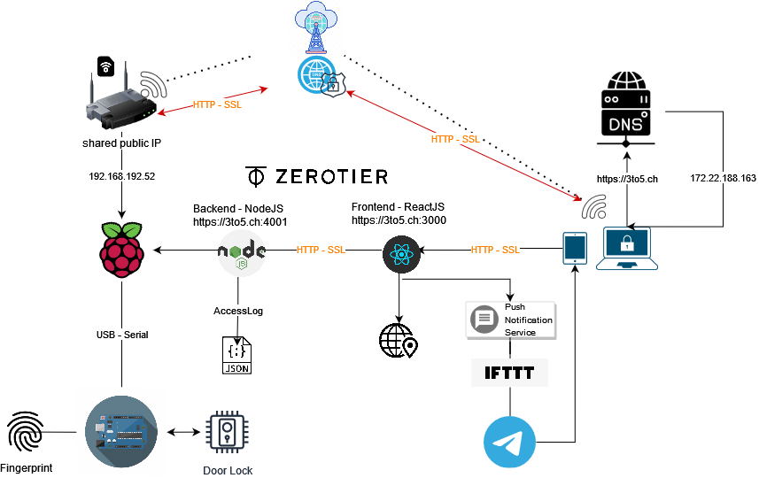

# IoT Engineering
## Project RemoteDoorControl

**Konzept:**

Remote steuerbares Türschloss mittels abgesicherter Zero-trust networking Lösung (265bit end2end verschlüsselt).

Motor, welcher einen Bolzen (Schliessmechanismus) bewegt, ist ein 12V DC - Linearer angetriebener Motor und wird über ein Arduino zusammen mit einem externen Stepper Chip gesteuert.
An dem Arduino ist ein Fingerprintsensor angehängt, welcher das Türschloss ebenfalls aktivieren kann.
Die API-Anbindung ist mittels NodeJS, zusammen mit dem Zero-trust VPN relisiert. Das Raspberry ist wiederum via Serial-USB mit dem Arduino verbunden.

Folgende API-Endpoint ist momentan vorgesehen:

| Verb | Ressouce | Description |
|:-----|:--------|:------|
| GET | /api/door | moves the bolt on the door (open/close) |
| GET | /api/status | get the door status (open/close) |

Die Halterung für Motor, Fingerprint, Verschalung für Raspberry & Arduino sind 3D-gedruckte Teile und in einer Miniatur Türe verbaut werden (für Demozwecke)

# Project Setup

**Requirements**
- DC Motor : https://de.aliexpress.com/item/4001171204865.html?spm=a2g0o.productlist.0.0.6cf22174bsHSHZ&algo_pvid=7be3442c-5065-4bd0-bfb2-10de5b5a7531&algo_exp_id=7be3442c-5065-4bd0-bfb2-10de5b5a7531-15&pdp_ext_f=%7B%22sku_id%22%3A%2212000015990025900%22%7D 
- Raspberry 4 : https://www.raspberrypi.com/products/raspberry-pi-4-model-b/
- Arduino UNO : https://store.arduino.cc/products/arduino-uno-rev3/
- IC Motor control : https://de.aliexpress.com/item/32844099228.html?spm=a2g0o.productlist.0.0.3f4648faXsiuPd&algo_pvid=48b7dc4e-e552-471c-b890-9da8f2f9c169&algo_exp_id=48b7dc4e-e552-471c-b890-9da8f2f9c169-3&pdp_ext_f=%7B%22sku_id%22%3A%2265215204221%22%7D
- Fingerprint : https://de.aliexpress.com/item/32863746593.html?spm=a2g0o.detail.1000023.4.4c137738Mbhi9o
- Endstop : https://de.aliexpress.com/item/1005003341364053.html?spm=a2g0o.productlist.0.0.4c071c2fWjLzoe&algo_pvid=5167e6be-1785-477d-864d-ef14ff6518ba&aem_p4p_detail=20211030044023451290956538800023611694&algo_exp_id=5167e6be-1785-477d-864d-ef14ff6518ba-4&pdp_ext_f=%7B%22sku_id%22%3A%2212000025305718909%22%7D

**Zerotrust-VPN**

Download Zerotier-VPN to access the API-Endpoint
- Download https://www.zerotier.com/download/
- Join Network `abfd31bd47ba5b87`

Once connected to the Zerotrust Network: API calls can be made using:  http://192.168.192.20:4001

## Project Raspberry [Nodejs API-Endpoint]

### Repository-Folder frontend:

1) `npm install` on RemoteDoorControl/Arduino/backend 
2) `npm start` will start the backend server on http://localhost:4001/ 

### Repository-Folder backend:

1) `npm install` on RemoteDoorControl/Arduino/frontend
2) `npm run start` will start the backend server on http://localhost:4001/ 
2.1) start server in dispatched mode `forever start server.js`

For Development purposes
`npm run dev` will start the backend server on http://localhost:4001/ 

Find blocking ports: `lsof -i :4001 -t` --> `kill xxx`

## Project Arduino [INO]

Upload the file [RemoteDoorControl/Arduino/00-Motor_Control.ino](RemoteDoorControl/Arduino/00-Motor_Control.ino) to Arduino and run script