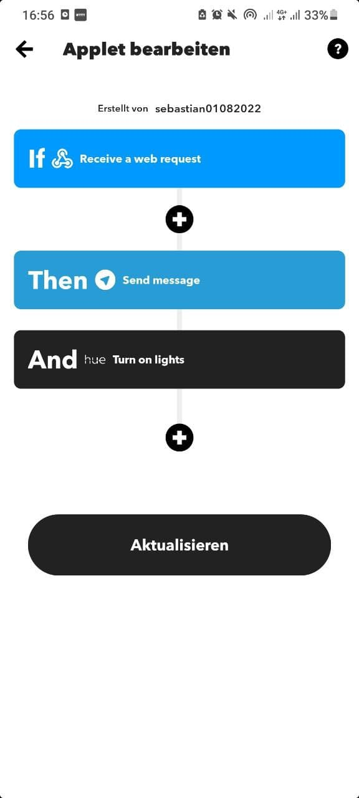

# IoT Engineering Project description

## Concept

Remote steuerbares Türschloss mittels abgesicherter Zero-trust networking Lösung (265bit end2end verschlüsselt).

Motor, welcher einen Bolzen (Schliessmechanismus) bewegt, ist ein 12V DC - Linearer angetriebener Motor und wird über ein Arduino zusammen mit einem externen Stepper Chip gesteuert.
An dem Arduino ist ein Fingerprintsensor angehängt, welcher das Türschloss ebenfalls aktivieren kann.
Die API-Anbindung ist mittels NodeJS, zusammen mit dem Zero-trust VPN relisiert. Das Raspberry ist wiederum via Serial-USB mit dem Arduino verbunden.

Folgende API-Endpoint ist momentan vorgesehen:

| Verb | Ressouce | Description |
|:-----|:--------|:------|
| POST | /api/door | moves the bolt on the door (open/close) |
| GET | /api/status | return the motor state (e.g door open / close) |
| GET | /api/total_operations | returns operations executed by Arduino |
| GET | /api/total_access | returns the amount of door open / closed |
| GET | /api/total_locations | return a list of permitted access locations (Fingerprint & Remote) |
| POST | /api/location | add access location to DB and returns all locations accessed |

Die Halterung für Motor, Fingerprint, Verschalung für Raspberry & Arduino sind 3D-gedruckte Teile und in einer Miniatur Türe verbaut werden (für Demozwecke)

# Project Setup

**Requirements**
- [DC Motor](https://de.aliexpress.com/item/4001171204865.html?spm=a2g0o.productlist.0.0.6cf22174bsHSHZ&algo_pvid=7be3442c-5065-4bd0-bfb2-10de5b5a7531&algo_exp_id=7be3442c-5065-4bd0-bfb2-10de5b5a7531-15&pdp_ext_f=%7B%22sku_id%22%3A%2212000015990025900%22%7D) 
- [Raspberry 4](https://www.raspberrypi.com/products/raspberry-pi-4-model-b/)
- [Arduino UNO](https://store.arduino.cc/products/arduino-uno-rev3/)
- [IC Motor control](https://de.aliexpress.com/item/32844099228.html?spm=a2g0o.productlist.0.0.3f4648faXsiuPd&algo_pvid=48b7dc4e-e552-471c-b890-9da8f2f9c169&algo_exp_id=48b7dc4e-e552-471c-b890-9da8f2f9c169-3&pdp_ext_f=%7B%22sku_id%22%3A%2265215204221%22%7D)
- [Fingerprint](https://de.aliexpress.com/item/32863746593.html?spm=a2g0o.detail.1000023.4.4c137738Mbhi9o)
- [Endstop](https://de.aliexpress.com/item/1005003341364053.html?spm=a2g0o.productlist.0.0.4c071c2fWjLzoe&algo_pvid=5167e6be-1785-477d-864d-ef14ff6518ba&aem_p4p_detail=20211030044023451290956538800023611694&algo_exp_id=5167e6be-1785-477d-864d-ef14ff6518ba-4&pdp_ext_f=%7B%22sku_id%22%3A%2212000025305718909%22%7D)

### Zerotrust-VPN Configuration

**Client (Windows, Android, IOS) Setup:**

Download Zerotier-VPN to access the Webservice
1) Download the zerotier client [Windows](https://www.zerotier.com/download/), [Android](https://play.google.com/store/apps/details?id=com.zerotier.one&hl=en_US&gl=US), [IOS](https://apps.apple.com/us/app/zerotier-one/id1084101492)
2) Join Network `abfd31bd47ba5b87`
3) Wait for confirmation of ZeroTier administrator

Once connected to the Zerotrust Network: API calls can be made using:  https://3to5.ch:4001/api/

**RaspberryPi (Server) Setup:**
1) Access Raspberry SSH console access
2) install zerotier-cli `curl -s https://install.zerotier.com | sudo bash`
3) or with GPG installed: `curl -s 'https://raw.githubusercontent.com/zerotier/ZeroTierOne/master/doc/contact%40zerotier.com.gpg' | gpg --import && \
if z=$(curl -s 'https://install.zerotier.com/' | gpg); then echo "$z" | sudo bash; fi`
4) start service `sudo service zerotier-one restart`
5) join network `sudo zerotier-one.zerotier-cli join <network id>`
# Deployment

**Prerequisite**
RaspberryPi has joined the Zerotier VPN and is configured properly
## Deploy on Arduino [INO]

1) navigate to RemoteDoorControl/Arduino/
2) Compile and upload project to Arduino [00-Motor_Control.ino](Arduino\00-Motor_Control\00-Motor_Control.ino) 

## Deployment on Raspberry [backend & frontend]
The backend is a Nodejs application. 
The frontend is a reactjs application.
Both applications run on a single raspberry connected to zerotier VPN network: playground: `abfd31bd47ba5b87`

### Deploy backend-service [NodeJs]:

1) navigate to RemoteDoorControl/RPI/Nodejs/backend
2) run `npm install`
3) plug in Arduino on USB-Serial interface
3) `npm run start` will start the backend server on https://3to5.ch:4001
4) nodemon for development purposes is configure and run with `npm run dev`
2.1) to start server in dispatched mode `forever start server.js`

Backend-API is reachable under: https://3to5.ch:4001/api/docs

Troubleshooting: 
1) Find blocking ports: `lsof -i :4001 -t` --> `kill xxx`
2) To find which USB interface is used `dmesg | grep USB`

### Deploy frontend-service [react-js]:

1) navigate to RemoteDoorControl/RPI/Nodejs/frontend
2) run `npm install` 
3) make sure SSL certificates are places on repositories root path
4) `(HTTPS=true SSL_CRT_FILE=cert.pem SSL_KEY_FILE=key.pem npm start&)` run production in HTTPS will start the frontend-service

Webapp is reachable under: https://3to5.ch:3000

### Generating self-signed-certificate
Create certificate and place it into root folder of Nodejs app. Files: key.pem, cert.pem
`openssl genrsa -out key.pem`
`openssl req -new -key key.pem -out csr.pem`
`openssl x509 -req -days 9999 -in csr.pem -signkey key.pem -out cert.pem`
`rm csr.pem`

# 3D Printed parts
## Door Lock

# Prototype

Webview

## Videos

Videos:
[Fingerprint - Demo](https://www.youtube.com/watch?v=CA1w-btZJAM)
[Remote Acces - Demo]()
## Production Links
[RemoteDoorControl - Webapp](https://3to5.ch:3000/)
[RemoteDoorControl - Backend (Swagger-UI)](https://3to5.ch:4001/api/docs/)

## Wiring

## IFTTT Setup

